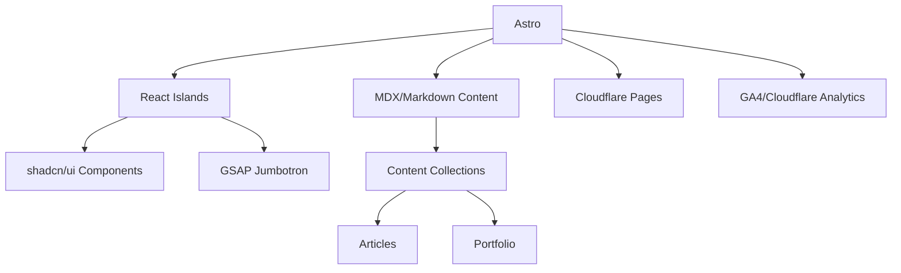

# プロジェクト雛形作成

## タスクの概要

Astro + React + TypeScript + Tailwind CSS構成で、ポートフォリオ＆ブログ用途のプロジェクト雛形を作成する。計測環境（GA4, Cloudflare Analytics）も初期導入する。

### DOMツリー図

```yaml
Layout:
  - Header: ナビゲーション
  - Main:
      - Jumbotron: ヒーローセクション（GSAPアニメーション）
      - ArticleList: 記事一覧
      - ArticleDetail: 記事詳細
      - PortfolioList: ポートフォリオ一覧
      - PortfolioDetail: ポートフォリオ詳細
      - MarkdownEditor: 記事作成（プレビュー付き）
  - Footer: フッター情報
```

### shadcn-ui使用判定

はい

### 使用するコンポーネント

- Button（shadcn/ui）
- Card（shadcn/ui）
- Input（shadcn/ui）
- Badge（shadcn/ui）
- Dialog（shadcn/ui）
- MarkdownEditor（独自）
- Jumbotron（独自＋GSAP）
- SearchBox（独自）

## アーキテクチャ図



## TODOリスト

- [ ] Astroプロジェクト初期化
- [ ] TypeScript strictモード設定
- [ ] Tailwind CSS導入
- [ ] React/MDX対応設定
- [ ] shadcn/uiセットアップ
- [ ] GSAP導入・設定
- [ ] Cloudflare Pages用設定（wrangler.toml等）
- [ ] GA4/Cloudflare Analyticsタグ設置
- [ ] Content Collections設定（記事・ポートフォリオ）
- [ ] サンプル記事・ポートフォリオデータ作成
- [ ] 基本レイアウト・ページ作成
- [ ] テスト・品質保証体制の初期設計
- [ ] ESLint・Prettier設定
- [ ] ビルド・デプロイ確認

## 技術的考慮事項

- **Astroの静的最適化を活かす設計**
  - Reactコンポーネントは必要最小限のisland化
  - 全ページReact化は非推奨。Astro/MDX主体で構成
- **shadcn/uiの利用**
  - React islandとして利用
  - Astroページでの使い方を明確化
- **記事管理の運用設計**
  - Markdown/MDXファイルの管理場所・命名規則・frontmatter設計を初期に決定
  - Content Collections活用
- **計測・SEO**
  - GA4/Cloudflare Analyticsのタグ設置方法を明確化
  - OGP・構造化データ・サイトマップ自動生成も初期から意識
- **認証・動的機能の拡張性**
  - 認証や管理画面は外部サービス連携（Auth0, Clerk, Firebase Auth等）を前提に設計
  - 複雑な動的機能は将来的なNext.js等への移行も視野に
- **テスト・品質保証**
  - Astro: PlaywrightやVitest
  - React: Testing Library等でテスト戦略を初期に設計
- **アクセシビリティ・パフォーマンス**
  - shadcn/uiはWCAG 2.1 AA準拠。独自実装部分もアクセシビリティ配慮
  - GSAP等のアニメーションは初期表示速度やLCPに影響しないよう遅延ロードやisland化を検討
- **技術スタック詳細**
  - メタフレームワーク: Astro
  - UIライブラリ: React（Astro内で利用）、shadcn/ui
  - スタイリング: Tailwind CSS
  - 型安全性: TypeScript（strictモード）
  - アニメーション: GSAP
  - Markdown処理: Astro Content Collection + MDX
  - デプロイ: Cloudflare Pages
  - 計測: Google Analytics 4、Cloudflare Analytics
