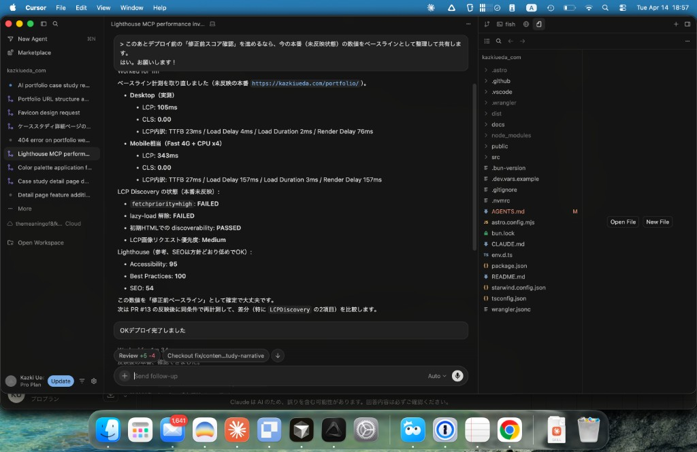

> このケーススタディ自体が、ここで紹介するワークフローの成果物です。

## きっかけ

転職活動に向けてポートフォリオを作ることにしました。ですがNDAもあり制作物をそのままお見せすることが難しい上に、事業クローズにつき古いサイトはお見せできないという課題にぶつかりました。そこで、ポートフォリオをWebサイトで作成し、またAIエージェントを活用した制作過程をまとめることで少しでも普段の制作をイメージしていただければと思いました。

## 本当の問題はどこにあったか

今回の制作時間はおよそ4日ほど。Astro + Cloudflare PagesでコンテンツはMarkdownというシンプルな構成で制作しました。キャリアの棚卸しとデザイン、制作を含め4日は意外と時間がなく大変でした。

## ツールに役割を持たせる

今回はCursorとPaperを中心に使いました。この二つは普段の制作でも使っているツールで、使用に関しての混乱などはなく、非常にスムーズにいきました。個人的に制作でのポイントとして、デザイナーが制作するならPaperを挟んでやるとAI Slopなレイアウトも解消できるのでおすすめだなと思います。

CursorはPaperの操作、コンテンツ草案作成、戦略、コーディングなどに活用しました。ちなみにClaudeCodeでも実装しましたが、Claudeを現在はMaxプランからProプランに変更し、Cursorを使用する運用をテストしているのでこのようになっています。

Paperはレイアウトのデザイン、思考を整理するために使いました。ここでFigmaを使わないのは、Paperの軽さと実装時の再現性の高さを気に入っているためです。またPaper Snapshotもレイアウトのアイデアを寝る時に非常に有用です。

この二つによって、要件定義から完成まで4日で完成させることができました。ですがAIエージェントによる開発はまだまだ課題も大きいと感じます。

## 品質をどう守るか

スピードが上がると品質が落ちやすい。これはAI協業に限った話ではないですが、とくにAIによるデザインの支援にはまだまだ課題も多く、そのためUIデザイナーの引き出しは非常に価値を増していると考えています。今回の制作において品質を維持するために意識したことを書きます。

デザインにおいては、一つはimpeccuableというSkill集を使ったAI Slopなデザインの評価です。これによってa11yやAIっぽいデザインの特徴を機械的に弾きます。二つ目は自分自身のアイデアを必ず制作の際に詳細に伝えることです。AIエージェントでの制作において言語化力は非常に重要なスキルになっていると感じます。

コードに関しては、基本的にほとんどエージェントに（気になる部分も含め）任せています。これは自分が修正を繰り返すとその都度コンテキストのズレが発生し実装品質が上がらないと感じているからです。そのためあくまで自然言語で変更してもらうようにしています。

このような知見は社内Slack、Notion、日報を通じて常に発信し続けています。

## やってみてわかったこと

私は2024年の秋頃から本格的に生成AIによる実装に賭けようと思い、社内でのデザイナーの生成AIによる制作支援の方法を試行錯誤してきました。身もふたもない話ですが、これだけ進化が早いとプロンプト・エンジニアリングなど簡単に陳腐化するため、先行者利益を得られたとは言えないのが現状です。

ですがやる中で感じているのは、デザインの複雑性によるAIによる代替の難しさです。あるデザインをトレースするためのプロンプトを作ることは可能ですが、同じデザインにしかなりません。汎用性を高めると、平均的なデザイン（AI Slop）なデザインとなってしまいます。今後しばらくはこのような現状をチャンスと捉え、デザイナーとしてのキャリアを歩めればと思います。
